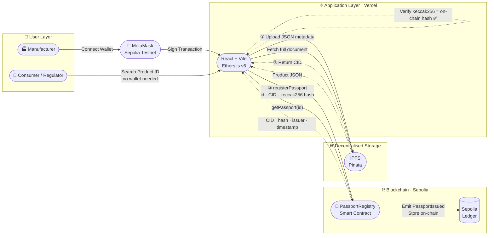
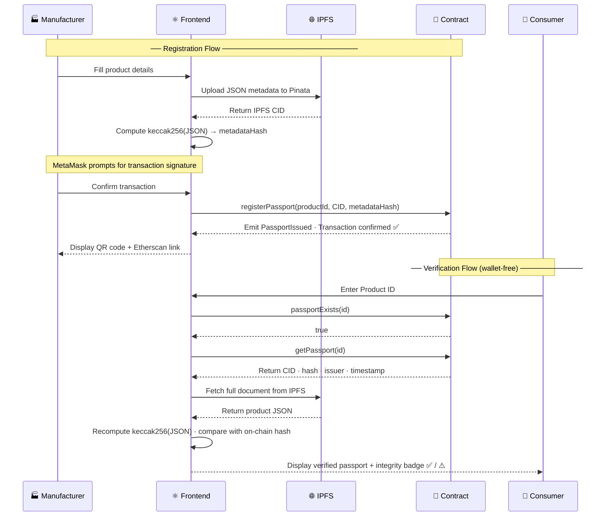

# EcoPassEU — Digital Product Passport DApp

> A privacy-aware, blockchain-powered Digital Product Passport (DPP) platform for sustainable consumer goods in Europe, built for the EU's Ecodesign for Sustainable Products Regulation (ESPR).

🌐 **Live Demo:** [https://ftgp-2526-group1-11.vercel.app/home](https://ftgp-2526-group1-11.vercel.app/home)  
📜 **Smart Contract:** [0x0617635eA34a7835807EbC6D0A7aECC9de8E1Cf0](https://sepolia.etherscan.io/address/0x0617635eA34a7835807EbC6D0A7aECC9de8E1Cf0)  
🔗 **Network:** Ethereum Sepolia Testnet

---

## Overview

EcoPassEU allows manufacturers to issue tamper-proof digital product passports on the blockchain. Consumers, regulators, and auditors can instantly verify any product's sustainability credentials — including material composition, supply chain provenance, recycling guidance, and certifications — without requiring any blockchain knowledge.

The platform is designed around a **hybrid on-chain / off-chain architecture**:
- **On-chain (Sepolia):** Product ID, IPFS document pointer (CID), cryptographic metadata hash, issuer address, timestamp
- **Off-chain (IPFS via Pinata):** Full product details — materials, supply chain stages, repair guides, recycling instructions

This approach keeps gas costs low while protecting commercially sensitive supply chain data.

---

## Key Features

| Feature | Description |
|---------|-------------|
| 🔒 Privacy-Aware | Sensitive data stays off-chain; only verifiable hashes on the ledger |
| ✅ Anti-Greenwashing | Cryptographic proofs prevent falsification of sustainability claims |
| 🏛️ ESPR Aligned | Built to meet EU Digital Product Passport regulation requirements |
| 🗺️ Supply Chain Map | Interactive map visualises the product's full journey |
| 📱 Mobile Compatible | Fully responsive design for smartphones and tablets |
| 💸 SME Friendly | Batch registration support keeps gas costs minimal |
| 🌐 Decentralised Storage | Documents stored on IPFS — no single point of failure |
| 🔍 Instant Verification | Anyone can verify any product in seconds, no account needed |

---

## Tech Stack

| Layer | Technology |
|-------|-----------|
| Frontend Framework | React + Vite |
| Routing | React Router DOM |
| Blockchain Interaction | Ethers.js v6 |
| Wallet | MetaMask |
| Smart Contract | Solidity ^0.8.20 |
| Decentralised Storage | IPFS via Pinata |
| Supply Chain Map | Leaflet.js + OpenStreetMap |
| Deployment | Vercel (frontend) + Sepolia Testnet (contract) |

---

## Project Structure

## Project Structure

| Directory / File | Description |
|-----------------|-------------|
| `contracts/` | Solidity smart contract source code |
| `scripts/` | IPFS upload and deployment scripts |
| `src/components/` | Reusable UI components (Navbar, WalletConnect, Map, LocationPicker) |
| `src/pages/` | Page components (Home, Register, Search, ProductDetail) |
| `src/utils/` | Contract ABI, address helpers, city coordinates database |
| `hardhat.config.js` | Hardhat local development configuration |
| `upload-result.json` | Latest IPFS upload results |

---

## System Architecture



## Data Flow




---

## Smart Contract

**Contract Address (Sepolia):**
0x0617635eA34a7835807EbC6D0A7aECC9de8E1Cf0

**Key Functions:**

| Function | Description |
|----------|-------------|
| `registerPassport(productId, ipfsCID, metadataHash)` | Register a single product passport |
| `batchRegisterPassports(ids[], CIDs[], hashes[])` | Register multiple products in one transaction |
| `getPassport(productId)` | Retrieve a product's passport data |
| `passportExists(productId)` | Check if a passport exists |

---

## Getting Started

### Prerequisites
- Node.js >= 18 ([Download](https://nodejs.org))
- MetaMask browser extension
- MetaMask switched to **Sepolia Testnet**
- Free test ETH from [Google Sepolia Faucet](https://cloud.google.com/application/web3/faucet/ethereum/sepolia)

### Installation

```bash
# Clone the repository
git clone https://github.com/DeTaiDong/FTGP2425_Group1_11.git

# Navigate to frontend
cd FTGP2425_Group1_11

# Install dependencies
npm install

# Start development server
npm run dev
```

Open [http://localhost:5173](http://localhost:5173) in your browser.

---

## Usage

### For Manufacturers — Register a Product
1. Connect your MetaMask wallet (Sepolia Testnet)
2. Navigate to **Register Product**
3. Fill in product details: basic info, material composition, supply chain stages
4. Click **Upload to IPFS** — your data is stored on IPFS
5. Click **Register on Blockchain** — confirm the MetaMask transaction
6. Your product passport is now permanently on-chain ✅

### For Consumers & Regulators — Verify a Product
1. Navigate to **Search Product**
2. Enter the Product ID (e.g. `ECO-TX-2025-001`)
3. View the verified passport — issuer, timestamp, IPFS document link
4. Click **View Full Detail** to see full material composition, supply chain map, and certifications

---

## IPFS Upload Script

To upload product data to IPFS before registering:

```bash
# Set your Pinata API credentials
$env:PINATA_API_KEY="your_api_key"
$env:PINATA_SECRET_API_KEY="your_secret_key"

# Run the upload script
node scripts/uploadToIPFS.js
```

Results are saved to `upload-result.json`.

---

## Team

**Group 11 — University of Bristol, SEMTM0029 Financial Technology**

| Name | Role |
|------|------|
| Detai Dong | Frontend Development, UI/UX, Deployment |
| Akshansh Rajora | Smart Contract, IPFS Integration |
| Luxiao Cao | Backend Scripts, Testing, Thesis Writing |
| Fuyu Cao | Research, Documentation |
| Tianwei Yu | Data Design, Product Passport Schema |

---

## Acknowledgements

- [EU ESPR Regulation](https://eur-lex.europa.eu/legal-content/EN/TXT/?uri=CELEX%3A32024R1781)
- [Pinata IPFS](https://pinata.cloud)
- [OpenStreetMap](https://www.openstreetmap.org)
- [Sepolia Testnet](https://sepolia.etherscan.io)

